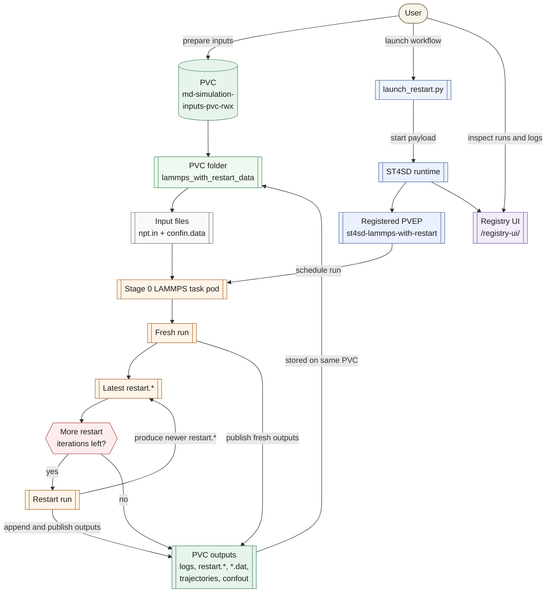
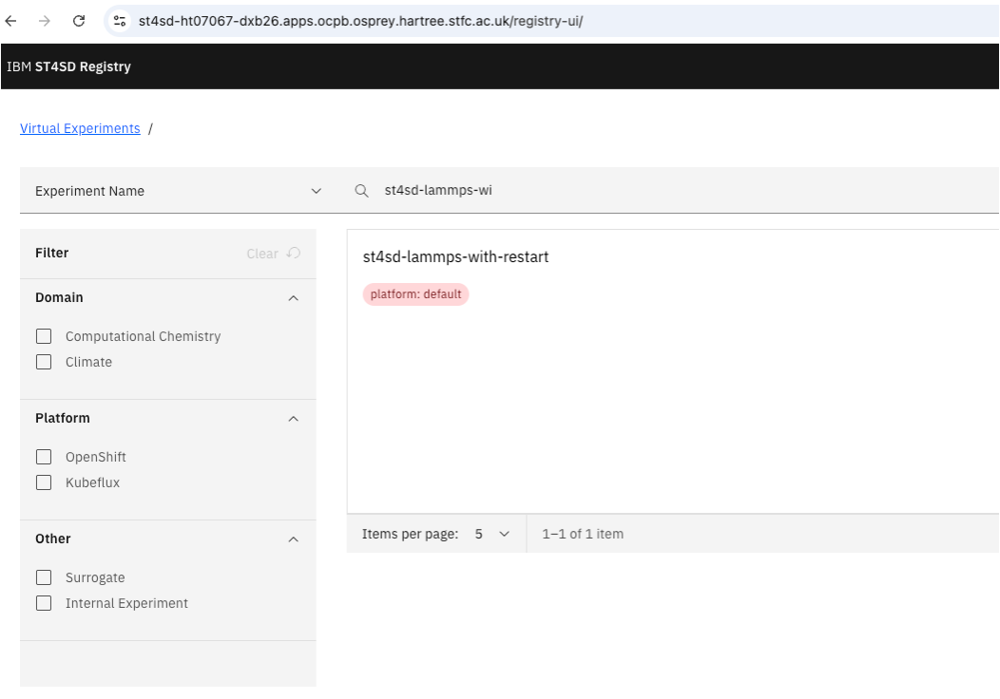
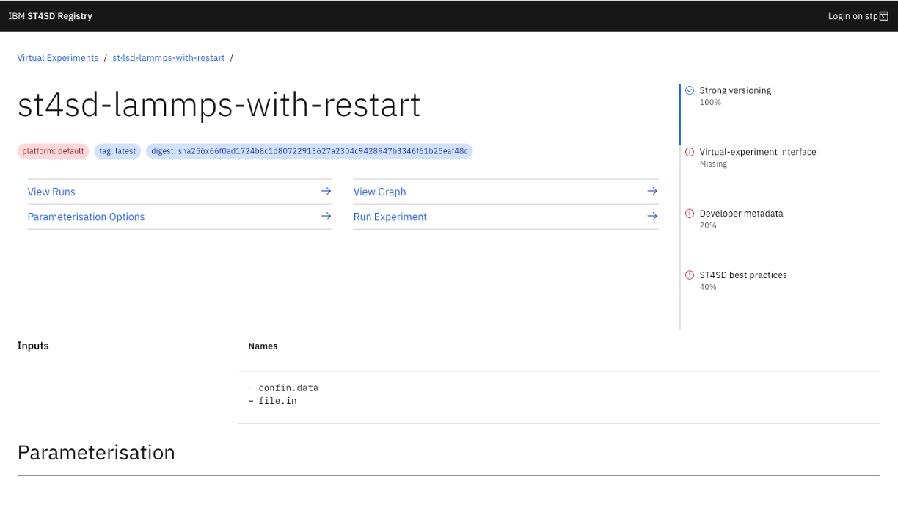
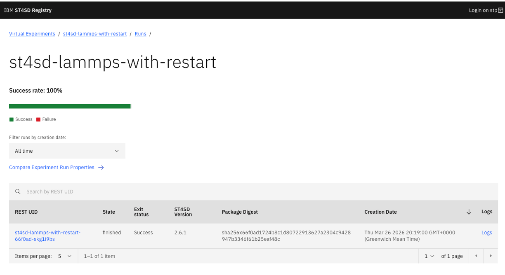
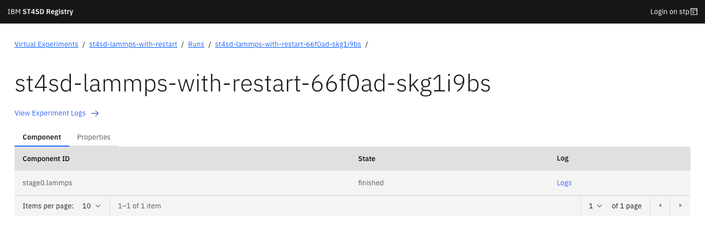
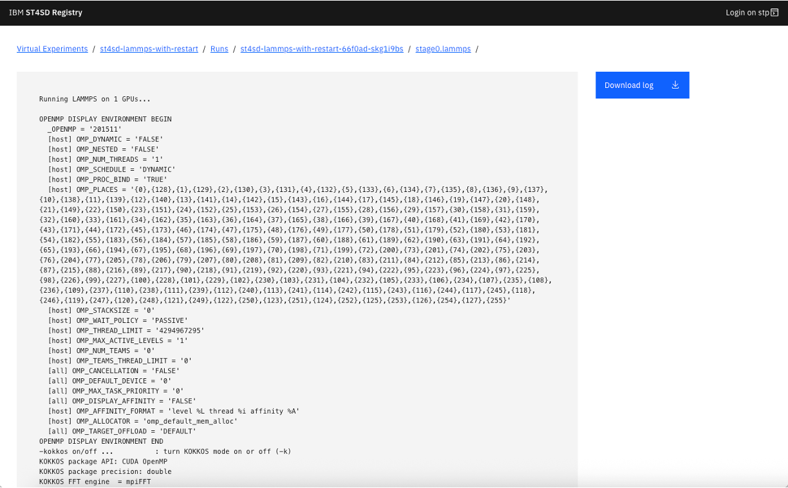
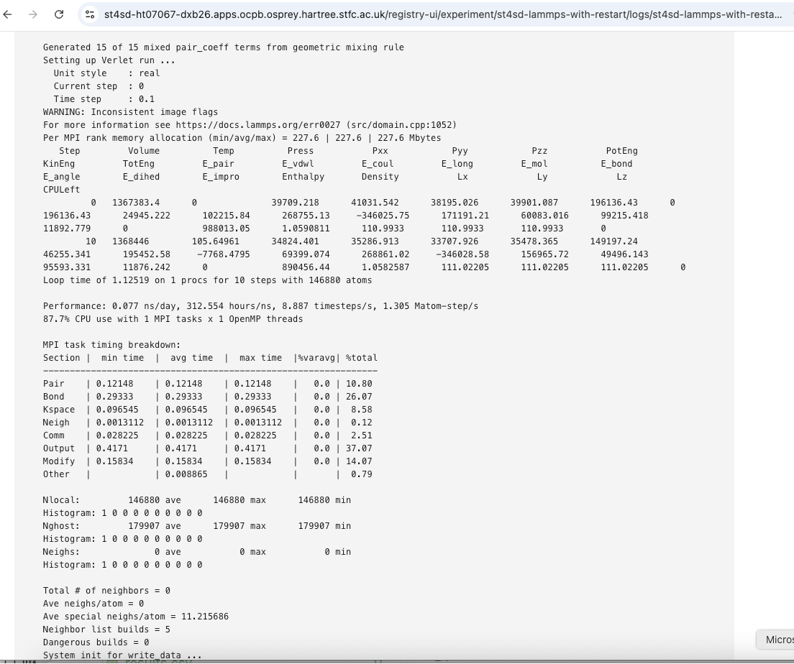

# ST4SD LAMMPS With Restart

This repository contains a workflow package for running a GPU-enabled LAMMPS simulation on a cluster from persistent storage, then continuing from the latest generated restart files for additional iterations.

## Table Of Contents

1. [Key Concepts](#1-key-concepts)
2. [Background](#2-background)
3. [Repository Layout](#3-repository-layout)
4. [Workflow Overview](#4-workflow-overview)
5. [Architecture Diagram](#5-architecture-diagram)
6. [Why Use ST4SD For This Workflow](#6-why-use-st4sd-for-this-workflow)
7. [Installation And Prerequisites](#7-installation-and-prerequisites)
8. [User Guide](#8-user-guide)
9. [Outputs](#9-outputs)
10. [Notes For Users Starting From Scratch](#10-notes-for-users-starting-from-scratch)
11. [Developer Guide](#11-developer-guide)
12. [Registry UI](#12-registry-ui)
13. [Resolved Challenges](#13-resolved-challenges)

## 1. Key Concepts

[ST4SD](https://st4sd.github.io/overview/), the Simulation Toolkit for Scientific Discovery, is an [IBM open-source](https://github.com/st4sd) workflow platform for packaging, parameterising, launching, and monitoring scientific workloads on cluster and cloud infrastructure.

The ST4SD runtime is the service that executes registered ST4SD workflows on cluster infrastructure, and it is called "runtime" because it handles the run-time orchestration of experiments after they have been packaged and registered.

[`Kubernetes`](https://kubernetes.io/docs/concepts/) is an open-source container orchestration platform used to schedule and run workloads across a cluster of machines. [`OpenShift`](https://st4sd.github.io/overview/st4sd-cloud-getting-started/) is Red Hat's Kubernetes-based platform, adding enterprise features, security controls, and operational tooling on top of Kubernetes.

A [`namespace`](https://kubernetes.io/docs/concepts/overview/working-with-objects/namespaces/) is a logical workspace inside a Kubernetes or OpenShift cluster. It is used to group and isolate related resources such as pods, services, and persistent storage claims.

A [`container`](https://kubernetes.io/docs/concepts/containers/) is a packaged runtime environment for an application, including its executable, libraries, and dependencies. A [`pod`](https://kubernetes.io/docs/concepts/workloads/pods/) is the basic execution unit in Kubernetes and OpenShift; it groups one or more containers that run together and can share storage and networking.

PVC stands for [`PersistentVolumeClaim`](https://kubernetes.io/docs/concepts/storage/persistent-volumes/). In Kubernetes and OpenShift, a PVC is a request for persistent storage that pods can mount in order to read and write files beyond the lifetime of a single container.

[`DSL2`](https://st4sd.github.io/overview/flowir/) in this context is ST4SD's second-generation declarative workflow format. It is used to describe workflow entrypoints, parameters, execution steps, components, and key outputs in a structured YAML file.

[`PVEP`](https://st4sd.github.io/overview/st4sd-registry-getting-started/) stands for Parameterised Virtual Experiment Package. In ST4SD, a PVEP is the registered package definition that users launch on the runtime, including its workflow source, parameters, and metadata.

[`stp`](https://st4sd.github.io/overview/st4sd-registry-getting-started/) is the ST4SD command-line interface used to log in to an ST4SD instance, manage contexts, and create, test, and register PVEPs.

## 2. Background

LAMMPS is a molecular dynamics engine widely used for atomistic and coarse-grained simulations. A typical LAMMPS run is driven by an input script such as `npt.in`, which in turn refers to simulation state files such as `confin.data`.

LAMMPS also supports restart files. A restart file captures binary simulation state so a later run can continue from a previous checkpoint rather than starting again from the initial data file.

The two main user-supplied input files are:

- `npt.in`
  The LAMMPS input script. It contains simulation commands such as force-field settings, thermostat and barostat configuration, restart frequency, trajectory output settings, and the run command itself.
- `confin.data`
  The LAMMPS data file. It contains the starting system definition, such as atom records, topology information, simulation box dimensions, and other structural data required to initialise the run.

In this package:

- `Fresh run` means the first LAMMPS execution starts from the original user inputs, namely `npt.in` and `confin.data`.
- `Latest restart.*` means the most recent restart file produced by the previous run, selected by sorting the available `restart.*` files and taking the newest one.
- `Restart iterations` means the number of times the workflow relaunches LAMMPS from the latest available restart file after the fresh run.
- The finish condition is iteration-count based, not convergence-based: the workflow stops after the configured number of restart iterations, which is `2` by default.

If the restart iteration count is set to `0`, the package behaves as a standard single-run LAMMPS workflow and only executes the initial fresh simulation.

## 3. Repository Layout

- [conf/dsl.yaml](/Users/ardita.shkurti/Documents/work/st4sd_stream/HT07067-polymer-binders-compatibility/st4sd-lammps-with-restart/conf/dsl.yaml)
  Main ST4SD DSL2 workflow definition.
- [package.json](/Users/ardita.shkurti/Documents/work/st4sd_stream/HT07067-polymer-binders-compatibility/st4sd-lammps-with-restart/package.json)
  PVEP package metadata and execution options.
- [launch_restart.py](/Users/ardita.shkurti/Documents/work/st4sd_stream/HT07067-polymer-binders-compatibility/st4sd-lammps-with-restart/launch_restart.py)
  Python launcher for the registered PVEP.
- [pvc-rwx.yaml](/Users/ardita.shkurti/Documents/work/st4sd_stream/HT07067-polymer-binders-compatibility/st4sd-lammps-with-restart/pvc-rwx.yaml)
  Example RWX PVC manifest.
- [pvc-shell-pod.yaml](/Users/ardita.shkurti/Documents/work/st4sd_stream/HT07067-polymer-binders-compatibility/st4sd-lammps-with-restart/pvc-shell-pod.yaml)
  Helper pod for browsing and copying files on the PVC.
- [images](/Users/ardita.shkurti/Documents/work/st4sd_stream/HT07067-polymer-binders-compatibility/st4sd-lammps-with-restart/images)
  Screenshots used by this README.

## 4. Workflow Overview

At a high level, the workflow does the following:

1. Accepts `npt.in` and `confin.data` as ST4SD file inputs, sourced from a PVC at launch time.
2. Copies those files into the task working directory as `file.in` and `confin.data`.
3. Runs a fresh LAMMPS job with `lmp_gpu`.
4. Finds the latest `restart.*` output produced by that run.
5. Rewrites the input so the next run starts from `read_restart <latest restart file>`.
6. Repeats the restart run for the configured number of iterations.
7. Copies logs, `restart.*`, `*.dat`, trajectory files, and final data snapshots back into the PVC folder.
8. Appends `*.dat` and trajectory outputs to cumulative PVC files so later restart outputs are added after earlier ones.

The current workflow performs:

- 1 fresh run
- 2 restart iterations by default

## 5. Architecture Diagram



The diagram shows the main flow:

- the user places `npt.in` and `confin.data` in the PVC folder
- `launch_restart.py` submits a start request to the ST4SD runtime
- the registered PVEP launches the LAMMPS task pod
- the task performs one fresh run, then restart iterations from the latest `restart.*`
- the restart loop ends when the configured iteration count has been exhausted
- logs, restart files, `*.dat`, trajectory files, and final data snapshots are written back to the same PVC folder
- cumulative `*.dat` and trajectory files grow as later restart outputs are appended
- runs can be inspected from the ST4SD registry UI

## 6. Why Use ST4SD For This Workflow

Using ST4SD provides several practical advantages for this LAMMPS workflow:

- reproducibility
  The workflow definition, runtime image, parameters, and launch pattern are captured in a reusable package rather than being manually reconstructed for each run.
- cluster-native execution
  ST4SD handles launching the workflow on the target cluster infrastructure, including interaction with Kubernetes and OpenShift resources.
- cleaner restart automation
  The fresh run and restart sequence are expressed once in the workflow logic, so users do not have to manually track and relaunch from the newest restart file.
- parameterised reuse
  The same registered PVEP can be reused by different users with different input files without rebuilding the whole package each time.
- observability
  ST4SD provides both command-line and web-based views of runs, logs, package definitions, and experiment history.
- easier collaboration
  Packaging the workflow in ST4SD makes it easier for users and developers to share the same execution model, inputs, outputs, and operating instructions.

## 7. Installation And Prerequisites

First, clone the repository:

```bash
git clone <repo-url>
cd st4sd-lammps-with-restart
```

Then log in to the target OpenShift cluster:

```bash
oc login <openshift-api-url>
```

Then log in to the target ST4SD context:

```bash
stp login <st4sd-auth-url>
```

You need:

- access to an ST4SD instance, meaning a deployed ST4SD service endpoint where PVEPs can be registered and experiments can be launched
- access to the target OpenShift / Kubernetes namespace
- `oc` installed and logged in
- the ST4SD CLI available as `stp`
- a Python environment with `experiment.service.db` available

If `oc` is not installed, download the OpenShift CLI for your operating system from your cluster's web console or from the official OpenShift CLI documentation:

- [OpenShift CLI installation docs](https://docs.redhat.com/en/documentation/openshift_container_platform/latest/html/cli_tools/openshift-cli-oc)

Then install it on your `PATH` and verify it with:

```bash
oc version
```

If the ST4SD CLI is not installed, create or activate a Python environment and install the ST4SD client packages there. The official ST4SD docs describe the CLI and client installation in the ST4SD Registry and ST4SD Services getting-started pages:

- [ST4SD Registry getting started](https://st4sd.github.io/overview/st4sd-registry-getting-started/)
- [ST4SD Services getting started](https://st4sd.github.io/overview/st4sd-services-getting-started/)

The ST4SD docs also show the runtime-core client installation pattern:

```bash
pip install "st4sd-runtime-core[develop]>=2.5.1"
```

Then verify that the CLI is available with:

```bash
stp --help
```

Typical ST4SD context checks:

```bash
stp context show
stp context list
```

Typical ST4SD login:

```bash
stp login "$ST4SD_AUTH_URL"
```

## 8. User Guide

### 8.1 Check Whether The PVC Already Exists

In the current example namespace, the PVC may already exist and be usable. Check first:

```bash
oc get pvc md-simulation-inputs-pvc-rwx
```

If the PVC is already present and `Bound`, you do not need to recreate it.

Only create it if:

- it does not exist
- it was deleted
- it is stuck and has to be recreated for a fresh setup

Create the RWX PVC only in that case:

```bash
oc apply -f pvc-rwx.yaml
oc get pvc md-simulation-inputs-pvc-rwx -w
```

Wait until it is `Bound`.

### 8.2 Create The Helper Pod

This pod keeps the PVC mounted so you can inspect and copy files:

```bash
oc apply -f pvc-shell-pod.yaml
oc wait --for=condition=Ready pod/md-simulation-inputs-shell --timeout=120s
```

### 8.3 Prepare The Input Folder On The PVC

This package expects a PVC subdirectory called:

```text
lammps_with_restart_data
```

Create it and copy your inputs:

```bash
oc exec md-simulation-inputs-shell -- mkdir -p /mnt/inputs/lammps_with_restart_data
oc cp <path-to-local-npt.in> md-simulation-inputs-shell:/mnt/inputs/lammps_with_restart_data/npt.in
oc cp <path-to-local-confin.data> md-simulation-inputs-shell:/mnt/inputs/lammps_with_restart_data/confin.data
```

If you want to inspect the files:

```bash
oc exec md-simulation-inputs-shell -- ls -l /mnt/inputs/lammps_with_restart_data
oc exec md-simulation-inputs-shell -- cat /mnt/inputs/lammps_with_restart_data/npt.in
```

### 8.4 Export Environment Variables

At minimum:

```bash
export ST4SD_RUNTIME_URL="https://st4sd-ht07067-dxb26.apps.ocpb.osprey.hartree.stfc.ac.uk"
export ST4SD_TOKEN="<your-token>"
```

Optional defaults:

```bash
export ST4SD_PVEP_NAME="st4sd-lammps-with-restart"
export ST4SD_INPUT_PVC="md-simulation-inputs-pvc-rwx"
export ST4SD_SOURCE_FILE="lammps_with_restart_data/npt.in"
export ST4SD_CONFIN_SOURCE="lammps_with_restart_data/confin.data"
```

You can discover your active ST4SD context with:

```bash
stp context show
```

### 8.5 Launch The Workflow

Run:

```bash
python launch_restart.py \
  --pvep st4sd-lammps-with-restart \
  --pvc md-simulation-inputs-pvc-rwx \
  --source-file lammps_with_restart_data/npt.in \
  --confin-source lammps_with_restart_data/confin.data
```

The launcher prints the experiment UID on success.

### 8.6 Check What Happened

List workflow pods:

```bash
oc get pods | grep st4sd-lammps-with-restart
oc get pods | grep flow-stage0-lammps
```

Check launcher logs:

```bash
oc logs <launcher-pod-name> -c elaunch-primary | tail -n 200
```

Check task logs:

```bash
oc logs <lammps-task-pod-name> | tail -n 200
```

Check the output folder on the PVC:

```bash
oc exec md-simulation-inputs-shell -- ls -l /mnt/inputs/lammps_with_restart_data
```

## 9. Outputs

You should expect the PVC folder `lammps_with_restart_data` to contain:

- `lammps_fresh.log`
- `lammps_restart_1.log`
- `lammps_restart_2.log`
- `restart.*`
- cumulative `*.dat` files
- cumulative trajectory files such as `*.lmptrj` or `*.lammpstrj`
- per-run copies of `*.dat` and trajectory files prefixed with the run label
- `confout_latest.data`

The current workflow writes multiple restart files because the LAMMPS input script contains:

```lammps
restart ${nres} restart.*
```

With `nres = 2`, each run may produce multiple restart snapshots such as:

- `restart.2`
- `restart.4`
- `restart.6`
- `restart.8`
- `restart.10`

The package now handles run outputs as follows:

- each run log is copied back to the PVC
- each run-specific `*.dat` file is copied back with a run prefix
- each run-specific trajectory file is copied back with a run prefix
- cumulative `*.dat` files are appended in run order so later restart data appears after earlier data
- cumulative trajectory files are appended in run order so later restart trajectory frames appear after earlier ones
- `confout_latest.data` is overwritten with the most recent final structure

The package also exposes ST4SD key outputs:

- `lammps-log`
  Backed by the `run_logs` output directory.
- `restart-files`
  Backed by the `restart_outputs` output directory.

## 10. Notes For Users Starting From Scratch

If you want to launch your own simulation from scratch:

1. Prepare your own `npt.in`.
2. Prepare your own `confin.data`.
3. Copy both files into `lammps_with_restart_data/` on the PVC.
4. If the PVEP is already registered and you are only changing input files, reuse the existing registered PVEP.
5. Only regenerate and re-register the PVEP if you have changed the workflow package itself, for example `dsl.yaml`, `package.json`, or the launcher logic.
6. Run `launch_restart.py`.

Important details:

- your initial `npt.in` does not need to contain `read_restart`
- the workflow rewrites later iteration inputs automatically to use the latest generated `restart.*`
- the package currently defaults to 2 restart iterations after the first fresh run

## 11. Developer Guide

### 11.1 What `dsl.yaml` Means

The DSL has three main levels:

- `entrypoint`
  Defines the user-facing experiment entry and the key outputs.
- `workflows`
  Wires user inputs and variables to component parameters.
- `components`
  Defines the actual executable task and runtime configuration.

In this package:

- `entrypoint.execute`
  Supplies:
  - file inputs `input/file.in` and `input/confin.data`
  - CPU and GPU counts
  - environment paths
  - PVC output directory
  - restart iteration count
- `workflows.lammps.execute`
  Maps workflow parameters into the component call.
- `components.lammps-single-file.command`
  Does the real work:
  - stage files locally
  - run the fresh simulation
  - discover the newest restart file
  - rewrite the input to `read_restart`
  - run restart iterations
  - publish logs, restart files, `*.dat`, trajectories, and final data back to the PVC
  - append cumulative `*.dat` and trajectory outputs on the PVC

### 11.2 How To Build A PVEP From Scratch

If you want to use this repository as a base:

1. Edit [conf/dsl.yaml](/Users/ardita.shkurti/Documents/work/st4sd_stream/HT07067-polymer-binders-compatibility/st4sd-lammps-with-restart/conf/dsl.yaml) to change the runtime logic.
2. Edit [package.json](/Users/ardita.shkurti/Documents/work/st4sd_stream/HT07067-polymer-binders-compatibility/st4sd-lammps-with-restart/package.json) to update metadata and execution options.
3. Commit and push the repository.
4. Regenerate the PVEP JSON.
5. Test the PVEP locally.
6. Push the PVEP to ST4SD.

Commands:

```bash
git add conf/dsl.yaml package.json launch_restart.py README.md
git commit -m "Update LAMMPS restart workflow"
git push origin main
```

```bash
stp package create --from .
stp package test st4sd-lammps-with-restart.json
stp package push st4sd-lammps-with-restart.json
```

### 11.3 Local Validation Before Cluster Registration

You can validate the package structure locally before pushing to the cluster:

```bash
python - <<'PY'
from experiment.model.storage import ExperimentPackage
pkg = ExperimentPackage.packageFromLocation('st4sd-lammps-with-restart')
print(type(pkg.configuration).__name__)
print(pkg.configuration.get_key_outputs())
PY
```

This checks that:

- the package parses as valid DSL2
- key outputs resolve correctly

Note that the package no longer sets an explicit `walltime` in the DSL. Task duration is therefore controlled by the runtime and backend defaults unless you add a component-level walltime again.

## 12. Registry UI

You can browse experiments, PVEPs, and logs in the ST4SD web UI at:

```text
<st4sd-instance-url>/registry-ui/
```

Current example:

```text
https://st4sd-ht07067-dxb26.apps.ocpb.osprey.hartree.stfc.ac.uk/registry-ui/
```

[Open current registry UI](https://st4sd-ht07067-dxb26.apps.ocpb.osprey.hartree.stfc.ac.uk/registry-ui/)

### 12.1 Registry UI Walkthrough

1. Open the registry UI and search for `st4sd-lammps-with-restart` in the Virtual Experiments view.



2. Open the `st4sd-lammps-with-restart` experiment page to inspect its inputs, parameterisation, graph, and run options.



3. Open the `Runs` view to inspect previously launched experiments, their REST UIDs, states, exit status, and links to logs.



4. Open a specific run to inspect component-level state and navigate to the corresponding task logs.



5. Open the component log view to inspect the LAMMPS runtime output directly in the browser or download the log file.



6. Open the experiment log page to inspect the textual runtime output in more detail when debugging run behaviour or verifying restart progression.



That UI is useful for:

- finding the registered PVEP
- browsing parameterisation and inputs
- inspecting run history
- opening component and experiment logs in the browser

## 13. Resolved Challenges

- The workflow was updated so restart handling no longer depends on an initial restart file being present on the PVC. It now performs a fresh run first and then continues from the latest generated `restart.*` file.
- The task command was aligned with the working cluster image by using `lmp_gpu` and the cluster-specific runtime environment variables for `PATH` and `LD_LIBRARY_PATH`.
- The package was adjusted to copy both run logs and restart files back to the PVC, making it easier to inspect results and to seed subsequent runs from the latest checkpoint.
- The workflow was extended so `*.dat`, trajectory files, and final data snapshots are also published back to the PVC, with cumulative files appended in run order across restart iterations.
